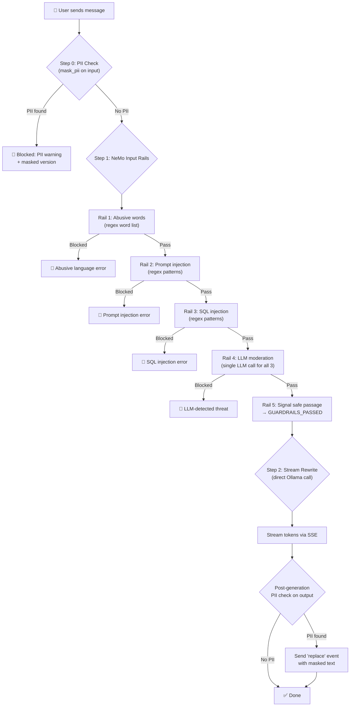

# 📖 `app.py` — Line-by-Line Explanation

This document explains every section of [app.py](file:///c:/Users/anura/Desktop/Innodeed/guardrail/app.py) in detail, with comparison tables wherever differentiation is needed.

---

## 1. Imports (Lines 1–16)

```python
import sys                          # System-level utilities (used to modify Python path)
import os                           # OS-level utilities (directory/path operations)
import json                         # JSON serialization (for SSE event formatting)
import uuid                         # Generate unique session IDs (UUID v4)
import logging                      # Python's built-in logging framework
import uvicorn                      # ASGI server to run the FastAPI app
from typing import Any, Optional    # Type hints for function signatures

import ollama                       # Official Ollama Python client (for direct LLM calls)
from fastapi import FastAPI         # The web framework used to build the API
from fastapi.staticfiles import StaticFiles       # Serve CSS/JS/HTML from a folder
from fastapi.responses import HTMLResponse, StreamingResponse  # Response types
from pydantic import BaseModel                     # Data validation for request bodies
from langchain_core.messages import BaseMessage    # LangChain's base message type
from langchain_ollama import ChatOllama            # LangChain wrapper for Ollama
from nemoguardrails import LLMRails, RailsConfig   # NVIDIA NeMo Guardrails
```

### What each import does:

| Import | Purpose | Used Where |
|--------|---------|------------|
| `sys`, `os` | Manipulate Python path to import `actions.py` from `config/` | Line 18–19 |
| `json` | Convert Python dicts to JSON strings for SSE events | `_sse()` helper |
| `uuid` | Generate random session IDs if client doesn't send one | `/api/chat` endpoint |
| `logging` | Log errors and warnings throughout the app | Error handlers |
| `uvicorn` | Run the FastAPI server (ASGI) | `__main__` block |
| `ollama` | Direct async Ollama client for streaming LLM responses | `stream_rewrite()` |
| `FastAPI` | Core web framework for REST API | App instance |
| `StaticFiles` | Serve the frontend HTML/CSS/JS from `static/` folder | Line 191 |
| `HTMLResponse` | Return HTML content from the root `/` endpoint | `root()` |
| `StreamingResponse` | Stream SSE (Server-Sent Events) back to the client | `/api/chat` |
| `BaseModel` | Define and validate the `ChatRequest` schema | `ChatRequest` class |
| `BaseMessage` | LangChain's message type, used in `NemoSafeChatOllama` | `_chat_params()` |
| `ChatOllama` | LangChain's Ollama wrapper — NeMo uses this internally | `NemoSafeChatOllama` |
| `LLMRails`, `RailsConfig` | NeMo Guardrails core — loads config and runs rails | Lines 46–52 |

---

## 2. Path Hack & Custom Import (Lines 18–19)

```python
sys.path.insert(0, os.path.join(os.path.dirname(__file__), "config"))
from actions import mask_pii
```

- **Line 18**: Adds the `config/` directory to Python's import search path. This is needed because `actions.py` lives inside `config/`, not at the project root.
- **Line 19**: Imports the `mask_pii` function from [config/actions.py](file:///c:/Users/anura/Desktop/Innodeed/guardrail/config/actions.py). This function takes a text string, detects PII (like card numbers, Aadhaar, emails, etc.), and replaces them with asterisks.

---

## 3. Logger & Constant (Lines 21–23)

```python
log = logging.getLogger(__name__)
GUARDRAILS_PASSED = "GUARDRAILS_PASSED"
```

- **`log`**: Creates a logger named after this module (`app`). Used for `log.error()` and `log.info()` calls.
- **`GUARDRAILS_PASSED`**: A magic string constant. When NeMo Guardrails finishes all input checks and nothing is blocked, it returns this exact string (configured in [rails.co](file:///c:/Users/anura/Desktop/Innodeed/guardrail/config/rails.co) line 65). The app checks for this to know the message is safe.

---

## 4. `NemoSafeChatOllama` Class (Lines 26–40)

```python
class NemoSafeChatOllama(ChatOllama):
    """ChatOllama subclass that moves NeMo-injected kwargs into Ollama's options dict."""

    def _chat_params(
        self,
        messages: list[BaseMessage],
        stop: list[str] | None = None,
        **kwargs: Any,
    ) -> dict[str, Any]:
        temp_override = kwargs.pop("temperature", None)
        kwargs.pop("streaming", None)
        params = super()._chat_params(messages, stop, **kwargs)
        if temp_override is not None and "options" in params:
            params["options"]["temperature"] = temp_override
        return params
```

### Why this class exists

NeMo Guardrails internally calls the LLM (e.g., for moderation checks) using LangChain's interface. When it does, it passes extra keyword arguments like `temperature` and `streaming`. However, **Ollama's API doesn't accept these as top-level parameters** — it expects them nested inside an `options` dict. Without this fix, Ollama would throw errors.

### What each line does:

| Line | Code | Purpose |
|------|------|---------|
| 35 | `kwargs.pop("temperature", None)` | Removes `temperature` from kwargs (NeMo injects this) and saves it |
| 36 | `kwargs.pop("streaming", None)` | Removes `streaming` from kwargs (Ollama doesn't accept it) and discards it |
| 37 | `params = super()._chat_params(...)` | Calls the parent `ChatOllama._chat_params()` to build the normal params dict |
| 38–39 | `if temp_override ... params["options"]["temperature"]` | If NeMo passed a temperature, puts it inside `params["options"]` where Ollama expects it |

### Comparison: `ChatOllama` vs `NemoSafeChatOllama`

| Feature | `ChatOllama` (parent) | `NemoSafeChatOllama` (custom) |
|---------|----------------------|-------------------------------|
| Handles NeMo's `temperature` kwarg | ❌ Crashes — passes to Ollama top-level | ✅ Moves it into `options` dict |
| Handles NeMo's `streaming` kwarg | ❌ Crashes — Ollama rejects it | ✅ Strips it out silently |
| Used by | General LangChain-Ollama apps | This app's NeMo integration specifically |

---

## 5. FastAPI App Instance (Line 43)

```python
app = FastAPI(title="GuardBot - AI Chatbot with NeMo Guardrails")
```

Creates the FastAPI application. The `title` is used in the auto-generated docs at `/docs`.

---

## 6. NeMo Guardrails Setup (Lines 45–52)

```python
# ── NeMo Guardrails (input rails only) ──
config = RailsConfig.from_path("./config")
nemo_llm = NemoSafeChatOllama(
    model="mistral",
    base_url="http://localhost:11434",
    num_predict=10,
)
rails = LLMRails(config, llm=nemo_llm)
```

| Line | What it does |
|------|--------------|
| `RailsConfig.from_path("./config")` | Loads the NeMo config from the `config/` directory — reads `config.yml`, `rails.co`, and auto-discovers `actions.py` |
| `NemoSafeChatOllama(...)` | Creates the custom Ollama LLM wrapper for NeMo to use internally (for moderation calls via `check_all_llm`) |
| `num_predict=10` | Limits NeMo's internal LLM calls to 10 tokens max (moderation answers are short: `"yes,no,no"`) |
| `LLMRails(config, llm=nemo_llm)` | Creates the guardrails engine, wiring the config + LLM together. This object runs the input rails pipeline. |

---

## 7. Direct Ollama Client (Lines 54–55)

```python
# ── Direct Ollama client (streaming rewrite) ──
ollama_client = ollama.AsyncClient(host="http://localhost:11434")
```

This is a **separate, direct** Ollama client — **not** the NeMo one. It's used for the actual text rewriting (the main task), with **streaming** support.

### Comparison: Two LLM Instances

| Property | `nemo_llm` (NemoSafeChatOllama) | `ollama_client` (ollama.AsyncClient) |
|----------|----------------------------------|--------------------------------------|
| **Purpose** | NeMo's internal moderation calls | Actual text rewriting (main task) |
| **Library** | LangChain (`ChatOllama` subclass) | Official `ollama` Python package |
| **Streaming** | ❌ No (NeMo doesn't stream) | ✅ Yes (token-by-token SSE) |
| **Token limit** | 10 tokens (`num_predict=10`) | 50 tokens (`num_predict: 50`) |
| **Used when** | During guardrail checks | After message passes all guardrails |
| **Async** | ✅ via LangChain `ainvoke` | ✅ native async client |

---

## 8. System Prompt (Lines 57–65)

```python
SYSTEM_PROMPT = (
    "You are a text rewriter. Your ONLY job is to rewrite the user's input "
    "in proper, grammatically correct, PROFESSIONAL English. Follow these rules strictly:\n\n"
    "- Output ONLY the rewritten sentence. Nothing else. No explanations, no greetings, no extra words.\n"
    "- ALWAYS use a professional and formal tone, regardless of how the user writes.\n"
    "- If the input is in Hindi (Devanagari or transliterated), translate it to professional English.\n"
    "- Do NOT answer questions. Do NOT provide information. Just rewrite/translate the text.\n"
    "- Keep the output under 50 tokens unless the input itself exceeds 50 tokens."
)
```

This is the **system prompt** used for the **rewriting LLM call** (not the moderation call). It instructs the Mistral model to:
1. Only rewrite/translate text — never answer questions
2. Always use professional English
3. Handle Hindi (Devanagari and transliterated) input
4. Keep output concise (under 50 tokens)

> [!NOTE]
> A similar but more detailed version of this prompt also exists in [config.yml](file:///c:/Users/anura/Desktop/Innodeed/guardrail/config/config.yml) (lines 12–29) for NeMo's internal use. The one here in `app.py` is used for the **direct Ollama** rewriting.

---

## 9. Session Storage (Line 67)

```python
sessions: dict[str, list[dict]] = {}
```

An **in-memory dictionary** that stores conversation history per session. Key = session ID (UUID string), Value = list of message dicts (`{"role": "user"/"assistant", "content": "..."}`).

> [!WARNING]
> This is volatile — all sessions are lost when the server restarts. For production, you'd use Redis, a database, etc.

---

## 10. Request Model (Lines 70–72)

```python
class ChatRequest(BaseModel):
    message: str
    session_id: Optional[str] = None
```

A **Pydantic model** that validates incoming POST requests to `/api/chat`. 

| Field | Type | Required | Default | Description |
|-------|------|----------|---------|-------------|
| `message` | `str` | ✅ Yes | — | The user's input text to be rewritten |
| `session_id` | `str` | ❌ No | `None` | Optional session ID. If omitted, a new UUID is generated |

---

## 11. SSE Helper (Lines 75–76)

```python
def _sse(data: dict) -> str:
    return f"data: {json.dumps(data)}\n\n"
```

Formats a Python dict as a **Server-Sent Event (SSE)** string. SSE is the protocol used for streaming responses from server to client.

**Example:**
```
Input:  {"type": "token", "content": "Hello"}
Output: data: {"type": "token", "content": "Hello"}\n\n
```

The `data: ` prefix and double newline (`\n\n`) are required by the SSE specification.

---

## 12. `stream_rewrite()` — Streaming LLM Rewrite (Lines 79–115)

This is an **async generator** function that streams the LLM's rewritten text token-by-token back to the client.

### Breakdown:

```python
async def stream_rewrite(message: str, session_id: str):
```
Takes the user's message and session ID. It's an async generator (uses `yield`).

```python
    yield _sse({"type": "start", "session_id": session_id})
```
**Step 1**: Sends a `start` event to the client so the frontend knows streaming has begun.

```python
    full_text = ""
    try:
        response = await ollama_client.chat(
            model="mistral",
            messages=[
                {"role": "system", "content": SYSTEM_PROMPT},
                {"role": "user", "content": message},
            ],
            stream=True,
            options={"num_predict": 50},
        )
```
**Step 2**: Calls the Ollama API with:
- The system prompt (rewriter instructions)
- The user message
- `stream=True` — enables token-by-token streaming
- `num_predict: 50` — max 50 tokens in the response

```python
        async for chunk in response:
            token = chunk["message"]["content"]
            full_text += token
            yield _sse({"type": "token", "content": token})
```
**Step 3**: As each token arrives from Ollama, it's:
- Appended to `full_text` (accumulates the complete response)
- Sent to the client as a `token` SSE event

```python
    except Exception as e:
        log.error(f"Ollama streaming error: {e}")
        yield _sse({"type": "error", "content": "Error generating response."})
        yield _sse({"type": "done"})
        return
```
**Error handling**: If the Ollama call fails, sends an error event and stops.

```python
    masked, labels = mask_pii(full_text)
    if labels:
        yield _sse({"type": "replace", "content": masked})
```
**Step 4 — Post-guardrail (output PII masking)**: After the entire response is generated, `mask_pii()` scans it for PII. If any is found (e.g., the LLM accidentally reproduced a card number), a `replace` event is sent with the masked version. The frontend replaces the streamed text with this masked version.

```python
    sessions.setdefault(session_id, [])
    final_text = masked if labels else full_text
    sessions[session_id].append({"role": "user", "content": message})
    sessions[session_id].append({"role": "assistant", "content": final_text})
```
**Step 5**: Saves both the user message and the assistant's response (masked if needed) to the session history.

```python
    yield _sse({"type": "done"})
```
**Step 6**: Sends a `done` event to signal the stream is complete.

### SSE Event Types Summary

| Event Type | When Sent | What the Frontend Does |
|-----------|-----------|------------------------|
| `start` | Beginning of stream | Initialize UI for incoming response |
| `token` | Each token from LLM | Append token to the response bubble |
| `replace` | After full response, if PII detected | Replace entire streamed text with masked version |
| `error` | If Ollama call fails | Show error message to user |
| `blocked` | If guardrail blocks the message | Show block reason to user |
| `done` | End of stream | Finalize UI, re-enable input |

---

## 13. `/api/chat` Endpoint (Lines 118–170)

This is the **main API endpoint** — the heart of the application. It processes every user message through a 3-step pipeline.

```python
@app.post("/api/chat")
async def chat(request: ChatRequest):
    session_id = request.session_id or str(uuid.uuid4())
```
Creates a new session ID if one wasn't provided.

### Step 0: Pre-NeMo PII Masking (Lines 122–139)

```python
    masked_text, pii_labels = mask_pii(request.message)
    if pii_labels:
        bot_message = (
            "I detected sensitive personal information in your message "
            f"({', '.join(pii_labels)}). Here is the masked version:\n\n"
            f"{masked_text}\n\n"
            "Please do not share personal information in chat."
        )
        # ... save to session and return blocked stream ...
        return StreamingResponse(pii_stream(), media_type="text/event-stream")
```

**Before NeMo even runs**, the message is scanned for PII using regex patterns. If PII is detected (card numbers, Aadhaar, email, etc.):
- A warning message is generated showing the masked text
- The message is **blocked immediately** (never reaches NeMo or the LLM)
- A `blocked` SSE event is returned

### Step 1: NeMo Input Rails (Lines 141–164)

```python
    try:
        nemo_response = await rails.generate_async(
            messages=[{"role": "user", "content": request.message}]
        )
        bot_message = nemo_response.get("content", "")
    except Exception as e:
        log.error(f"NeMo guardrails error: {e}")
        bot_message = GUARDRAILS_PASSED
```

The message is sent through NeMo Guardrails. NeMo runs the following **input rail subflows** in order (defined in [rails.co](file:///c:/Users/anura/Desktop/Innodeed/guardrail/config/rails.co)):

| Rail # | Subflow Name | Python Action | What It Checks |
|--------|-------------|---------------|----------------|
| 1 | `check abusive language` | `check_abusive_words()` | English + Hindi abusive word lists |
| 2 | `check prompt injection` | `check_prompt_injection()` | Regex patterns for prompt manipulation |
| 3 | `check sql injection` | `check_sql_injection()` | Regex patterns for SQL injection attacks |
| 4 | `check all threats llm` | `check_all_llm()` | LLM-based moderation (catches things regex misses) |
| 5 | `signal safe passage` | (none — Colang only) | Returns `"GUARDRAILS_PASSED"` if nothing blocked |

Each rail can either:
- **`stop`** → blocks the message and returns a canned error message
- **Pass** → message moves to the next rail

If **all rails pass**, NeMo returns `"GUARDRAILS_PASSED"`.

```python
    if bot_message != GUARDRAILS_PASSED:
        # Blocked by a guardrail — return the block message
        return StreamingResponse(blocked_stream(), media_type="text/event-stream")
```

If NeMo returned anything other than `GUARDRAILS_PASSED`, the message was blocked. The block message (e.g., "abusive language detected") is returned to the client.

> [!NOTE]
> If NeMo itself throws an error (exception), the code **defaults to `GUARDRAILS_PASSED`** (line 152). This is a fail-open design — if guardails crash, the message still gets processed rather than silently failing.

### Step 2: Stream Rewrite (Lines 166–170)

```python
    return StreamingResponse(
        stream_rewrite(request.message, session_id),
        media_type="text/event-stream",
    )
```

If the message passed all guardrails, it's sent to `stream_rewrite()` which:
1. Calls Ollama directly (bypasses NeMo for speed + streaming)
2. Streams the rewritten text token-by-token
3. Applies post-generation PII masking on the output

### Full Request Lifecycle



---

## 14. `/api/reset` Endpoint (Lines 173–177)

```python
@app.post("/api/reset")
async def reset_session(session_id: Optional[str] = None):
    if session_id and session_id in sessions:
        del sessions[session_id]
    return {"status": "ok", "message": "Session reset successfully"}
```

Deletes a session's conversation history from memory. If the session ID doesn't exist, it still returns success (idempotent).

---

## 15. `/api/health` Endpoint (Lines 180–182)

```python
@app.get("/api/health")
async def health_check():
    return {"status": "healthy", "model": "mistral (ollama)", "guardrails": "nemo + streaming"}
```

A simple health check endpoint. Returns basic info about the running configuration. Useful for monitoring/load-balancers.

---

## 16. Frontend Serving (Lines 185–191)

```python
@app.get("/", response_class=HTMLResponse)
async def root():
    with open("static/index.html", "r", encoding="utf-8") as f:
        return HTMLResponse(content=f.read())

app.mount("/static", StaticFiles(directory="static"), name="static")
```

| Line | What it does |
|------|--------------|
| `@app.get("/")` | When someone visits `http://localhost:8000/`, serve the chat UI |
| `open("static/index.html")` | Reads the HTML file and returns it as an HTML response |
| `app.mount("/static", ...)` | Makes everything in the `static/` folder accessible at `/static/...` URLs (CSS, JS, images) |

---

## 17. Entry Point (Lines 194–195)

```python
if __name__ == "__main__":
    uvicorn.run("app:app", host="0.0.0.0", port=8000, reload=True)
```

When you run `python app.py` directly:
- **`"app:app"`** — tells uvicorn to find the `app` variable in the `app` module
- **`host="0.0.0.0"`** — listens on all network interfaces (accessible from other machines)
- **`port=8000`** — runs on port 8000
- **`reload=True`** — auto-restarts the server when code changes (development mode)

---

## 📊 API Endpoints Summary

| Method | Endpoint | Purpose | Auth | Response Type |
|--------|----------|---------|------|---------------|
| `POST` | `/api/chat` | Send a message for guardrail check + rewrite | None | SSE stream |
| `POST` | `/api/reset` | Clear session history | None | JSON |
| `GET` | `/api/health` | Health check | None | JSON |
| `GET` | `/` | Serve chat UI | None | HTML |
| `GET` | `/static/*` | Serve static assets (CSS/JS) | None | Static files |

---

## 🔑 Key Architectural Decisions

### 1. Two-LLM Architecture
The app uses **two separate LLM connections** to the same Mistral model:

| Aspect | NeMo LLM (`nemo_llm`) | Rewrite LLM (`ollama_client`) |
|--------|------------------------|-------------------------------|
| **When** | During guardrail checking | After guardrails pass |
| **Library** | LangChain via `ChatOllama` | Direct `ollama` client |
| **Streaming** | No | Yes (token-by-token) |
| **Max tokens** | 10 (just needs "yes,no,no") | 50 (full rewrite) |
| **Why separate** | NeMo requires LangChain interface | Streaming requires direct client |

### 2. Fail-Open Guardrails
If NeMo crashes (line 152), the message **passes through** rather than getting blocked. This ensures the service stays usable even if the guardrails component has issues.

### 3. Dual PII Checking
PII is checked **twice**:
- **Pre-LLM** (Step 0): On the user's input — blocks the message entirely
- **Post-LLM** (in `stream_rewrite`): On the LLM's output — masks any PII the model might reproduce

### 4. NeMo Bypass for Rewriting
After guardrails pass, the rewrite is done via **direct Ollama** (not through NeMo). This is because:
- NeMo doesn't support streaming
- NeMo adds overhead (intent classification, flow execution)
- The rewrite only needs a simple `system + user` prompt, not NeMo's flow engine
